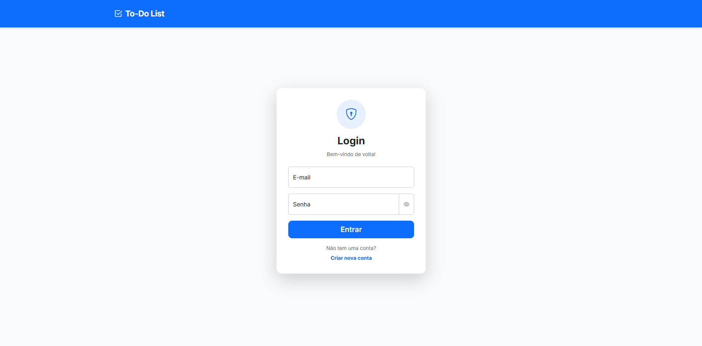
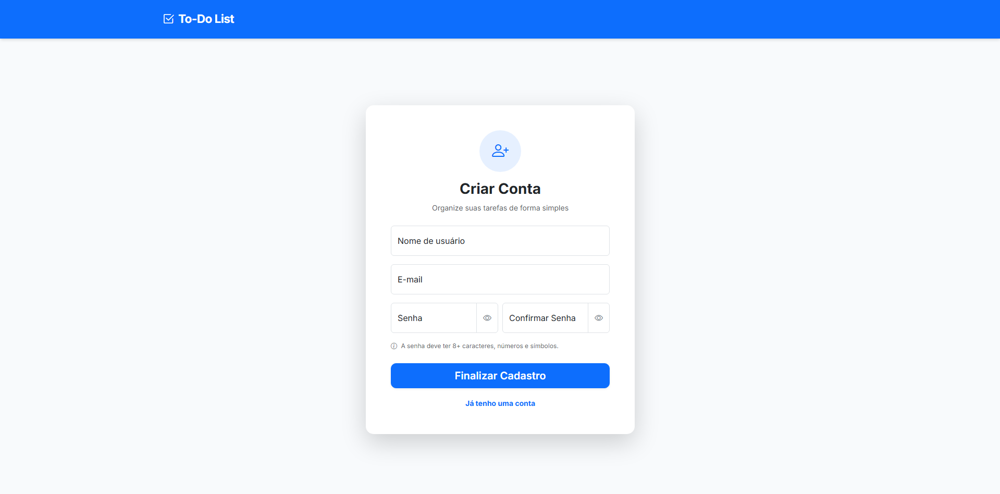
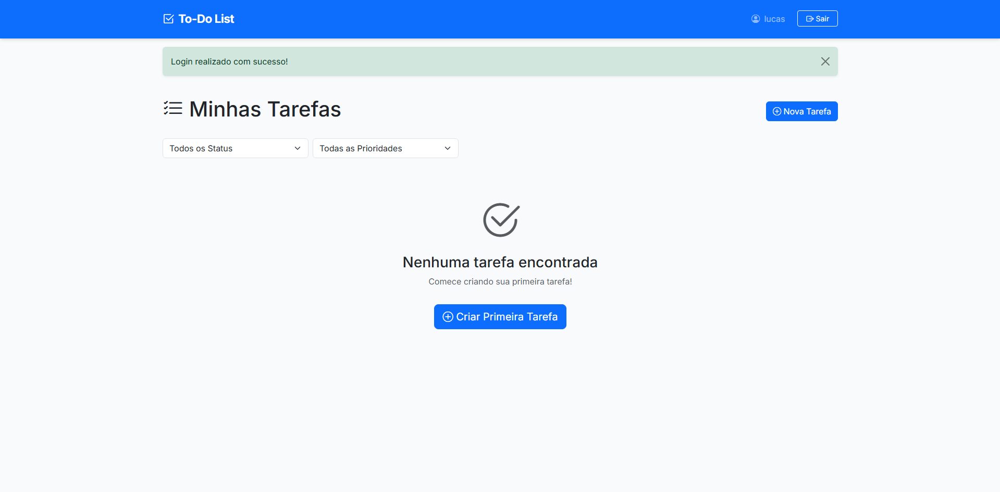
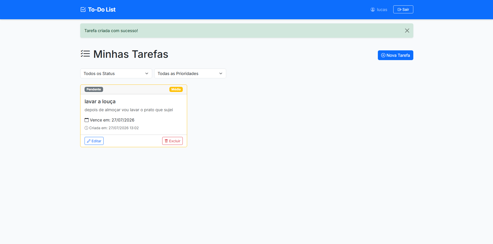
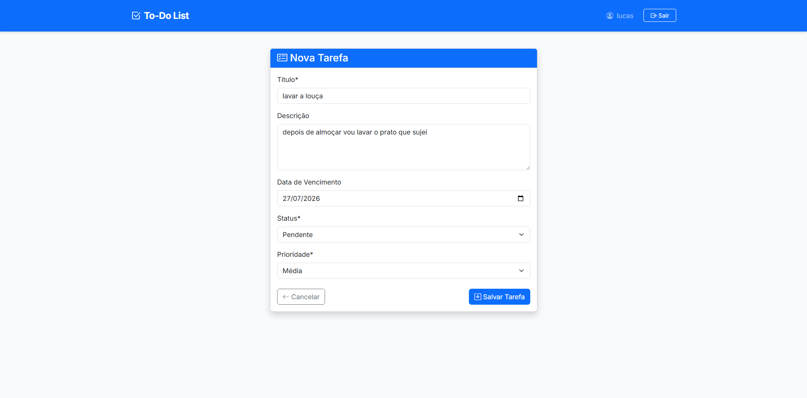
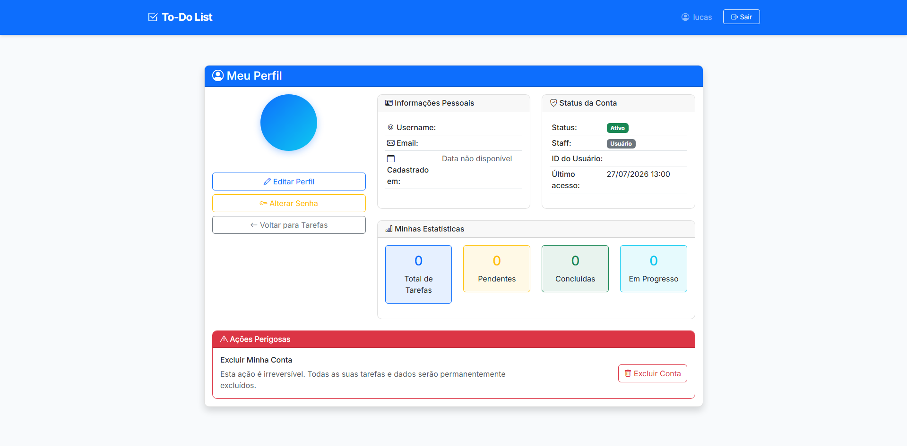

# To-Do List

Aplicação web de gerenciamento de tarefas construída com Django, com autenticação baseada em sessão, CRUD completo de tarefas e gerenciamento de perfil de usuário.

O projeto segue uma arquitetura de dois apps: `auth_api` cuida de toda a lógica de autenticação e usuários através de uma camada de serviço, enquanto `tasks` gerencia o domínio de tarefas de forma independente. A autenticação é abstraída por uma classe `APIService` — projetada para funcionar localmente com um fallback `DummyResponse`, tornando o sistema completamente funcional sem dependências externas.

---

## Funcionalidades

| Funcionalidade          | Descrição                                                                                                 |
| ----------------------- | --------------------------------------------------------------------------------------------------------- |
| Cadastro e Login        | Criação de usuário e autenticação por sessão via e-mail e senha                                           |
| CRUD de Tarefas         | Criar, editar, visualizar e excluir tarefas com título, descrição, prazo, status e prioridade             |
| Filtros                 | Filtrar tarefas por status (pendente, em progresso, concluída) e prioridade (baixa, média, alta)          |
| Perfil do Usuário       | Visualizar dados da conta, estatísticas de tarefas, editar username/e-mail, alterar senha e excluir conta |
| Gerenciamento de Sessão | Sessão autenticada persiste por 24 horas via engine de sessão do Django                                   |
| UI Responsiva           | Layout Bootstrap 5 adaptado para desktop, tablet e mobile                                                 |

---

## Screenshots

**Login**


**Cadastro**


**Tela Inicial**


**Lista com Tarefas**


**Cadastrar Tarefa**


**Perfil do Usuário**


---

## Estrutura do Projeto

```
├── auth_api/                  # App de autenticação e gerenciamento de usuários
│   ├── services.py            # APIService — abstrai a lógica de auth com fallback local
│   └── views.py               # Views de login, cadastro, perfil, senha e exclusão de conta
├── tasks/                     # App do domínio de tarefas
│   ├── models.py              # Model Task (título, descrição, prazo, status, prioridade)
│   ├── forms.py               # TaskForm com widgets compatíveis com Bootstrap
│   ├── views.py               # TaskListView, TaskCreateView, TaskUpdateView, TaskDeleteView
│   └── urls.py                # Rotas de tarefas
├── templates/
│   ├── auth/                  # login.html, register.html, profile.html
│   └── tasks/                 # task_list.html, task_form.html
├── docs/
│   └── screenshots/           # Screenshots do projeto
├── todolist_project/
│   ├── settings.py
│   └── urls.py
├── manage.py
└── requirements.txt
```

---

## Tecnologias

**Backend**

- Python 3.12
- Django 5.2
- Django REST Framework 3.16
- django-crispy-forms + crispy-bootstrap5

**Frontend**

- Bootstrap 5.3
- Bootstrap Icons
- JavaScript (vanilla)

**Banco de Dados**

- SQLite (desenvolvimento local)

**Servidor**

- Gunicorn

---

## Como Executar

**1. Clonar o repositório**

```bash
git clone https://github.com/luccaszzzz/to_do_list.git
cd to_do_list
```

**2. Criar e ativar o ambiente virtual**

```bash
python -m venv venv
# Windows
.\venv\Scripts\Activate.ps1
# Linux/Mac
source venv/bin/activate
```

**3. Instalar as dependências**

```bash
pip install -r requirements.txt
```

**4. Aplicar as migrações**

```bash
python manage.py migrate
```

**5. Criar um superusuário (opcional)**

```bash
python manage.py createsuperuser
```

**6. Iniciar o servidor**

```bash
python manage.py runserver
```

Acesse em `http://127.0.0.1:8000/`

---

## Autores

- [Lucas Emanoel da Silva Freitas](https://www.linkedin.com/in/lucas-emanoel-38a440238/)
- [Júlia Galvão](https://www.linkedin.com/in/júlia-galvão-644ab9270/)

---

[Read in English](README.md)
